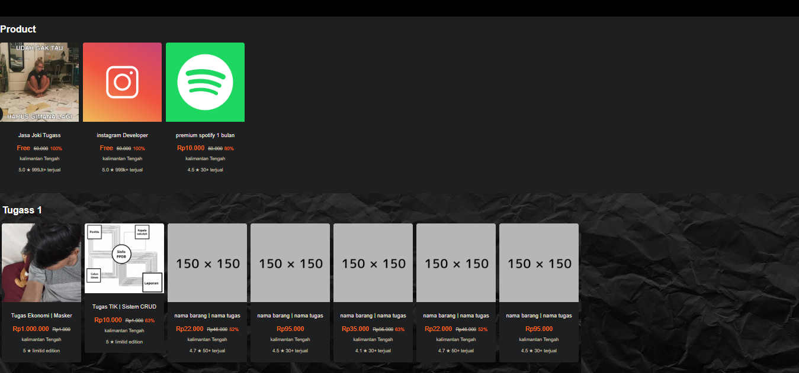

# 🛍️ Website Online Shop Sederhana

Ini adalah proyek website toko online sederhana yang dibangun menggunakan **HTML**, **CSS**, dan **JavaScript**. Website ini dirancang sebagai halaman statis untuk menampilkan produk, deskripsi, harga, dan tombol beli sederhana.

## 🔧 Fitur Utama

- Tampilan responsif
- Daftar produk dengan gambar, nama, dan harga
- Tombol "Beli Sekarang" (belum terhubung ke backend)
- Navigasi sederhana
- Animasi dasar menggunakan CSS dan JavaScript

## 📁 Struktur Folder

```
.
├── index.html
├── style.css
├── script.js
├── /images
│   └── (gambar produk)
```

## 🖼️ Preview



## 🚀 Cara Menjalankan

1. Clone repository:
   ```bash
   git clone https://github.com/username/nama-repo-olshop.git
   ```
2. Buka file `index.html` di browser.

Tidak diperlukan server atau framework tambahan karena ini adalah website statis.

## 📌 Catatan

- Website ini belum terintegrasi dengan sistem backend atau payment gateway.
- Cocok untuk latihan, pengembangan awal, atau presentasi UI toko online.

## 💡 Pengembangan Selanjutnya

- Menambahkan fitur keranjang belanja (shopping cart)
- Integrasi sistem login/daftar
- Backend sederhana menggunakan Firebase / Node.js
